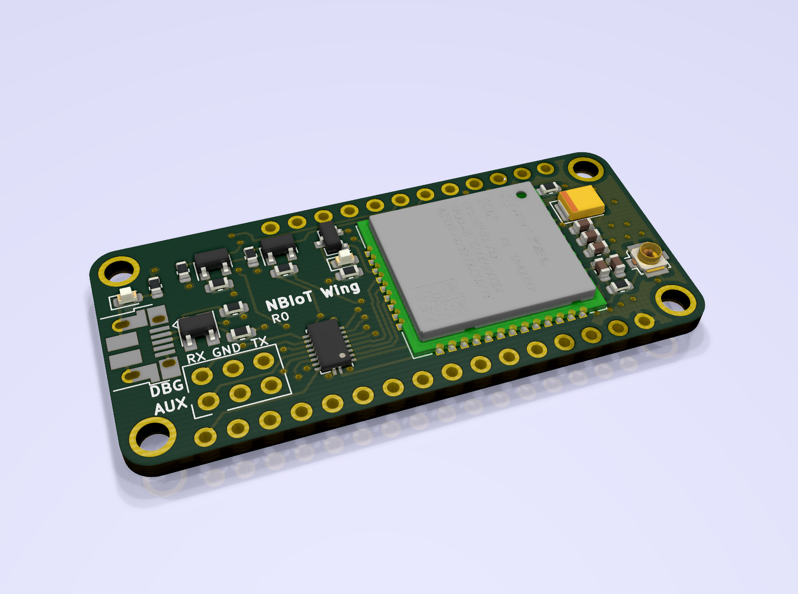
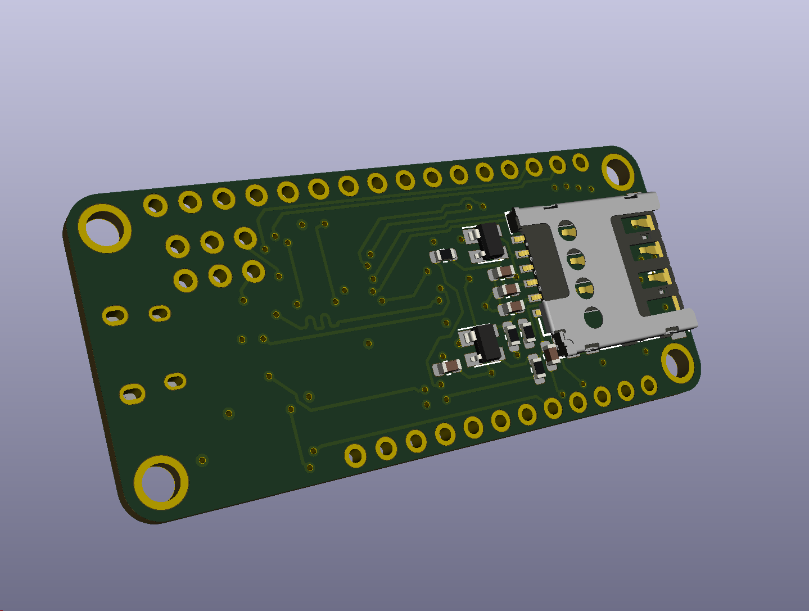

# NBIoT Wing

This is a Feather "Wing" which can be added to any feather board. It works by sending AT commands over the RX/TX pins that are on D0/D1 of the feather board.

The NBIoT wing also has an optional USB port that allows it to be used as a stand-alone serial USB modem from your PC.

The wing features the BC66 modem by Quectel Wireless which features Cat NB1 LTE.

## Front

## Back

